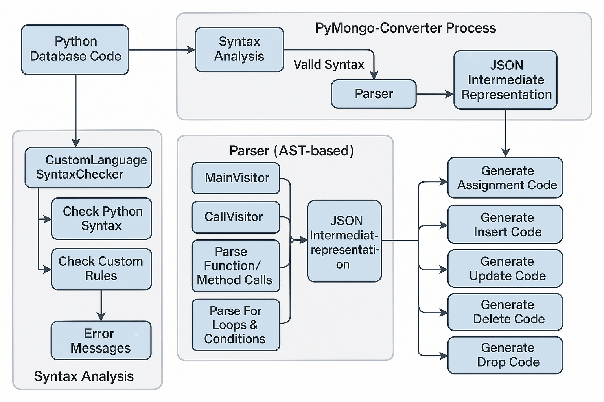

# PyMongo-Converter

PyMongo-Converter is a powerful utility that transforms Python code into MongoDB queries, allowing developers to write database operations using familiar Python syntax. This tool bridges the gap between Python programming and MongoDB's query language, making database interactions more intuitive for Python developers.

## Overview

PyMongo-Converter translates Python-style database operations into their MongoDB equivalents through a sophisticated three-step process:

1. **Syntax Analysis**: Validates the Python code structure and catches syntax errors
2. **Parsing**: Converts the validated Python code into an intermediate JSON representation using AST (Abstract Syntax Tree)
3. **Code Generation**: Transforms the JSON structure into equivalent MongoDB queries

This approach ensures reliable conversion while maintaining the semantic meaning of the original Python operations.

## Features

- Create and delete databases and collections
- Insert single and multiple documents
- Query documents with complex conditions using Python-like syntax
- Update documents with various modifiers
- Delete documents based on complex criteria
- For-loop based queries with conditional filtering
- Comprehensive syntax validation

## How It Works

### Step 1: Syntax Analysis

The syntax analyzer validates the Python code before processing. It uses a combination of Python's built-in `ast` module and custom regex patterns to ensure the code follows both valid Python syntax and the custom rules defined for our database operations.

```python
# Example of syntax checking
checker = CustomLanguageSyntaxChecker()
errors = checker.check_syntax(code)
if errors:
    for error in errors:
        print(error)
else:
    print("Syntax is valid!")
```

The syntax analyzer checks for:
- Valid database creation syntax
- Proper table creation
- Correct insert, update, and delete operations
- Valid loop structures for queries
- Appropriate number of arguments for each method

### Step 2: Parser

The parser uses Python's AST (Abstract Syntax Tree) to analyze the code structure and convert it into a JSON representation. This intermediate format breaks down the code into its components, handling:

- Variable assignments
- Function and method calls
- For loops and their conditions
- Complex query conditions

```python
# Using the parser
visitor = MainVisitor()
results = visitor.visit(tree)
with open("results.json", "w") as f:
    json.dump(results, f, indent=4)
```

The parser utilizes specialized visitors for different code elements:
- AssignmentVisitor: Captures variable assignments
- CallVisitor: Handles function and method calls
- LoopVisitor: Processes for loops and their conditions

### Step 3: Code Generation

The code generation phase transforms the intermediate JSON representation into valid MongoDB queries. This step handles the translation of Python syntax into MongoDB's query language.

```python
# Generate MongoDB code
generator = MainGenerator()
mongodb_code = generator.generate_code()
generator.show_code()
```

The generator handles:
- Creating databases and collections
- Inserting documents
- Updating documents with complex conditions
- Deleting documents
- Generating find queries from for loops
- Dropping collections and databases

## Example Transformation

### Input (Python-style code):

```python
mydb = create_db("myDB")
users = create_table(mydb)
users.insert_one({"key": "value", "age": 324})
users.insert_many([{"key1": "value1"}, {"key2": "value2"}])

for obj in users:
    if obj["Rating"] > 4.5 or obj["Rating"] == 5:
        print(obj)

users.delete_one([{'name': 'Alice', 'age': 20, 'city': 'New York'}])
users.delete_one(['age>18 and age<30 or age!=25 and condition2=="value2"'])
users.update_one(["age > 30 and key2==5"], ["condition1 = 100, condition2='value2'"])

users.delete_table()
mydb.delete()
```

### Output (MongoDB queries):

```javascript
use myDB
db.createCollection('users');
db.users.insertOne({'key': 'value', 'age': 324});
db.users.insertMany([{'key1': 'value1'}, {'key2': 'value2'}]);
db.users.updateOne({'$and': [{'age': {'$gt': 30}}, {'key2': 5}]}, {'$set': {'condition1': 100, 'condition2': 'value2'}});
db.users.deleteOne({'name': 'Alice', 'age': 20, 'city': 'New York'});
db.users.deleteOne({'$or': [{'$and': [{'age': {'$gt': 18}}, {'age': {'$lt': 30}}]}, {'$and': [{'age': {'$ne': 25}}, {'condition2': 'value2'}]}]});
printjson(db.users.find({'$or': [{'Rating': {'$gt': 4.5}}, {'Rating': 5}]}).toArray());
db.users.drop();
db.dropDatabase();
```


## Flowchart



## Installation

```bash
git clone https://github.com/username/pymongo-converter.git
cd pymongo-converter
pip install -r requirements.txt
```

## Usage

```python
from pymongo_converter import convert

# Convert Python code to MongoDB
python_code = """
mydb = create_db("myDB")
users = create_table(mydb)
users.insert_one({"name": "John", "age": 30})
"""

mongodb_code = convert(python_code)
print(mongodb_code)
```

## Contributing

Contributions are welcome! Please feel free to submit a Pull Request.

